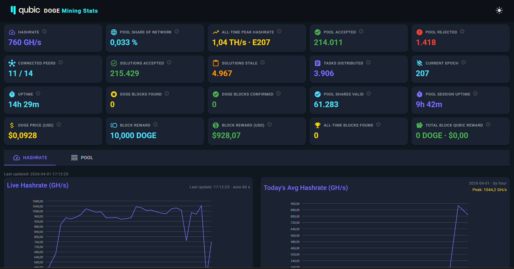

# Qubic Doge Stats

Real-time mining statistics dashboard for **Qubic × Dogecoin** mining operations.

Data is polled every 60 seconds from the public [doge-stats.qubic.org](https://doge-stats.qubic.org) API and stored locally. A Blazor WebAssembly frontend visualizes hashrate, pool stats, epoch history, Dogecoin block finds, and more.



---

## Features

- Live hashrate monitoring (GH/s) with 60-minute trend chart
- **Pool Share of Network** — pool hashrate as a percentage of total DOGE network hashrate (24h average)
- Pool stats: accepted / rejected / submitted shares
- Solutions tracking: accepted, received, rejected, stale
- Connected peers and active tasks
- **DOGE price** (USD) — polled hourly from CoinPaprika
- Qubic epoch tracking with automatic epoch-change detection
- Epoch comparison charts (hashrate, solutions & pool shares per epoch)
- Current epoch timeline chart (day-by-day breakdown, avg hashrate per day)
- Today's hashrate by hour
- **Tooltips on all stat cards** — hover the info icon for an explanation of each metric
- **Dogecoin Pool Dashboard** (tabbed on home page):
  - Live pool stats: blocks found/confirmed, shares valid/invalid, session uptime
  - Blocks per epoch bar chart
  - Recent blocks table with links to Dogechain Explorer
  - Full block history table
- **Light / dark mode** with iOS-style glassmorphism panels in light mode
- Fully self-hosted via Docker

---

## Architecture

```
External APIs
  https://doge-stats.qubic.org/dispatcher.json   (mining stats)
  https://doge-stats.qubic.org/pool.json          (DOGE pool stats)
  https://rpc.qubic.org/v1/tick-info              (Qubic epoch)
  https://api.blockchair.com/dogecoin/stats        (DOGE network hashrate)
  https://api.coinpaprika.com/v1/tickers/doge-dogecoin  (DOGE price)
           │          │          │          │          │
  DogeStatsClient  PoolStats  QubicRpc  DogeExplorer DogePriceClient
      Client        Client    Client      Client     (every 1 h)
           │          │          │          │
  DogeStatsPolling  PoolPolling  │   DogeExplorerPolling
     Worker         Worker       │       Worker
  (every 60 s,    (every 60 s)  │     (every 5 min)
   epoch-aware)        │         │
           │       PoolBlock  HashrateSnapshot
           │           └──────────┬──────────┘
           │                      │
           │           LiteDB  (doge_stats.db)
           │                      │
           └──────────────────────┤
                                  │
              ┌───────────────────┴─────────────────┐
              │                                       │
     Minimal API (ASP.NET)               Blazor WASM (Client)
     /api/snapshots/latest               Home.razor
     /api/snapshots/history                ├─ Tab: Hashrate charts
     /api/pool/latest                      └─ Tab: Pool dashboard
     /api/pool/blocks
     /api/network/stats
     /api/doge/price
```

---

## API Endpoints

Base URL (local): `http://localhost:5159`

### `GET /api/snapshots/latest`

Returns the most recent stored snapshot.

**Response `200 OK`:**
```json
{
  "id": "...",
  "timestamp": "2026-03-31T12:00:00+00:00",
  "hashrate": 1234567890,
  "hashrateDisplay": "1.23 GH/s",
  "poolDifficulty": 100000,
  "tasksDistributed": 512,
  "activeTasks": 48,
  "connectedPeers": 312,
  "totalPeers": 450,
  "poolAccepted": 98234,
  "poolRejected": 12,
  "poolSubmitted": 98246,
  "solutionsAccepted": 7412,
  "solutionsReceived": 7415,
  "solutionsRejected": 3,
  "solutionsStale": 0,
  "uptimeSeconds": 864000,
  "queueSolutions": 0,
  "queueStratum": 2,
  "qubicEpoch": 180
}
```

**Response `404 Not Found`** — no data collected yet.

---

### `GET /api/snapshots/history?limit=100`

Returns the most recent N snapshots, ordered by time (newest first).

| Parameter | Type | Default | Max | Description |
|-----------|------|---------|-----|-------------|
| `limit` | `int` | `100` | `10080` | Number of snapshots to return (10 080 = ~7 days at 1/min) |

**Response `200 OK`:** Array of `HashrateSnapshot` objects (same schema as above).

---

### `GET /api/pool/latest`

Returns the latest live pool stats from the most recent `pool.json` poll.

**Response `200 OK`:**
```json
{
  "sessionStart": "2026-03-31T21:32:27+00:00",
  "sharesValid": 61283,
  "sharesInvalid": 129,
  "blocksFound": 0,
  "blocksConfirmed": 0,
  "lastShareTime": "2026-04-01T10:31:24.050Z",
  "lastBlockTime": null,
  "lastBlockHeight": null
}
```

**Response `404 Not Found`** — no pool data collected yet.

---

### `GET /api/pool/blocks`

Returns all stored Dogecoin block finds, ordered by time (newest first).

**Response `200 OK`:** Array of `PoolBlock` objects:
```json
[
  {
    "id": "...",
    "height": 6147250,
    "hash": "a3f9b7c2...",
    "worker": "DRcdWw4LyKFanwQvNXAp3y9i3Afi8VZLG3",
    "time": "2026-04-01T06:40:00Z",
    "confirmed": true,
    "qubicEpoch": 180
  }
]
```

---

### `GET /api/network/stats`

Returns the latest DOGE network stats fetched from blockchair.com (refreshed every 5 minutes).

**Response `200 OK`:**
```json
{
  "networkHashrate": 1578374434381559,
  "bestBlockHeight": 6148000,
  "fetchedAt": "2026-04-01T10:00:00Z"
}
```

**Response `404 Not Found`** — no network data collected yet.

---

### `GET /api/doge/price`

Returns the latest DOGE/USD price from CoinPaprika (refreshed every hour).

**Response `200 OK`:**
```json
{
  "usdPrice": 0.1234,
  "fetchedAt": "2026-04-01T10:00:00Z"
}
```

**Response `404 Not Found`** — no price data collected yet.

---

## Data Models

### `HashrateSnapshot`

| Field | Type | Source | Description |
|-------|------|--------|-------------|
| `timestamp` | `DateTimeOffset` | Server | UTC time of the poll |
| `hashrate` | `long` | `mining.hashrate` | Raw hashrate in H/s |
| `hashrateDisplay` | `string` | `mining.hashrate_display` | Human-readable (e.g. "1.23 GH/s") |
| `poolDifficulty` | `long` | `mining.pool_difficulty` | Current pool difficulty |
| `tasksDistributed` | `int` | `mining.tasks_distributed` | Total tasks distributed |
| `activeTasks` | `int` | `active_tasks` | Currently active tasks |
| `connectedPeers` | `int` | `network.connected_peers` | Active peer connections |
| `totalPeers` | `int` | `network.total_peers` | Total known peers |
| `poolAccepted` | `int` | `pool.accepted` | Pool shares accepted |
| `poolRejected` | `int` | `pool.rejected` | Pool shares rejected |
| `poolSubmitted` | `int` | `pool.submitted` | Pool shares submitted |
| `solutionsAccepted` | `int` | `solutions.accepted` | Solutions accepted by network |
| `solutionsReceived` | `int` | `solutions.received` | Solutions received by pool |
| `solutionsRejected` | `int` | `solutions.rejected` | Solutions rejected |
| `solutionsStale` | `int` | `solutions.stale` | Stale solutions |
| `uptimeSeconds` | `long` | `uptime_seconds` | Node uptime |
| `queueSolutions` | `int` | `queues.solutions` | Solutions in queue |
| `queueStratum` | `int` | `queues.stratum` | Stratum connections in queue |
| `qubicEpoch` | `int` | `rpc.qubic.org` | Current Qubic epoch number |

### `DogeNetworkStats`

Fetched every 5 minutes from blockchair.com. Not persisted to database — held in memory only.

| Field | Type | Description |
|-------|------|-------------|
| `networkHashrate` | `long` | 24h average DOGE network hashrate in H/s |
| `bestBlockHeight` | `long` | Current chain tip (best block height) |
| `fetchedAt` | `DateTimeOffset` | UTC time of the last successful fetch |

### `DogePriceStats`

Fetched every hour from CoinPaprika. Not persisted — held in memory only.

| Field | Type | Description |
|-------|------|-------------|
| `usdPrice` | `decimal` | Current DOGE price in USD |
| `fetchedAt` | `DateTimeOffset` | UTC time of the last successful fetch |

### `PoolBlock`

Permanently stored whenever a new DOGE block find appears in `pool.json`. Deduplicated by `hash`.

| Field | Type | Description |
|-------|------|-------------|
| `height` | `long` | DOGE block height |
| `hash` | `string` | Block hash |
| `worker` | `string` | Worker address that found the block |
| `time` | `DateTimeOffset` | Time the block was found |
| `confirmed` | `bool` | Whether the block is confirmed on-chain |
| `qubicEpoch` | `int` | Derived from block time (Wednesday 12:00 UTC boundary) |

---

## Epoch Tracking

A new Qubic epoch begins every **Wednesday at 12:00 UTC**. The polling worker:

- Refreshes the epoch from `rpc.qubic.org/v1/tick-info` every **5 minutes** normally
- During the **Wednesday 11:00–15:00 UTC** transition window: refreshes on **every poll** to catch the changeover as quickly as possible
- Logs an info message when an epoch change is detected

DOGE block finds are assigned to the correct Qubic epoch using the same Wednesday 12:00 UTC boundary logic.

---

## Configuration

All settings can be overridden via `appsettings.json`, environment variables, or Docker environment.

| Key | Default | Description |
|-----|---------|-------------|
| `DogeStats:ApiUrl` | `https://doge-stats.qubic.org/dispatcher.json` | Mining stats source |
| `DogeStats:PollIntervalSeconds` | `60` | Poll interval in seconds |
| `PoolStats:ApiUrl` | `https://doge-stats.qubic.org/pool.json` | DOGE pool stats source |
| `QubicRpc:BaseUrl` | `https://rpc.qubic.org/` | Qubic RPC base URL |
| `LiteDb:Filename` | `Data/doge_stats.db` | LiteDB database file path |

**Docker environment variables:**

| Variable | Description |
|----------|-------------|
| `DATA_DIR` | Directory for the LiteDB file (e.g. `/data`) |
| `LITEDB_FILE` | DB filename inside `DATA_DIR` (e.g. `doge_stats.db`) |
| `ASPNETCORE_URLS` | Listening URL (default `http://+:8080`) |

---

## Running Locally

**Prerequisites:** .NET 10 SDK

```bash
git clone https://github.com/AndyQus/qubic-doge-stats.git
cd qubic_doge_stats/qubic_doge_stats
dotnet run
```

Open `http://localhost:5159` in your browser.

---

## Docker Deployment

**Prerequisites:** Docker

```bash
# Build the image
docker build -t qubic_doge_stats .

# Run with a persistent volume
docker run -d \
  --name qubic_doge_stats \
  -p 8080:8080 \
  -v qubic_doge_data:/data \
  -e DATA_DIR=/data \
  -e LITEDB_FILE=doge_stats.db \
  --restart unless-stopped \
  qubic_doge_stats
```

The app will be available at `http://localhost:8080`.

The database is persisted in a named Docker volume (`qubic_doge_data`).

---

## Tech Stack

| Layer | Technology |
|-------|-----------|
| Runtime | .NET 10 / ASP.NET Core |
| Frontend | Blazor WebAssembly |
| UI Components | MudBlazor 9.x |
| Database | LiteDB 5.x (embedded, file-based) |
| Container | Docker / Docker Compose |

---

## External Data Sources

| Source | URL | Description |
|--------|-----|-------------|
| DogeStats API | `https://doge-stats.qubic.org/dispatcher.json` | Mining pool statistics |
| Pool Stats API | `https://doge-stats.qubic.org/pool.json` | DOGE block finds & share counts |
| Qubic RPC | `https://rpc.qubic.org/v1/tick-info` | Current epoch / tick info |
| Blockchair | `https://api.blockchair.com/dogecoin/stats` | DOGE network hashrate (24h avg) |
| CoinPaprika | `https://api.coinpaprika.com/v1/tickers/doge-dogecoin` | DOGE/USD price |

---

## Disclaimer

This application is in **beta**. All data is retrieved from public endpoints.
Completeness, accuracy, and availability of the captured data are not guaranteed.
Use it for demonstration and analysis purposes only.
